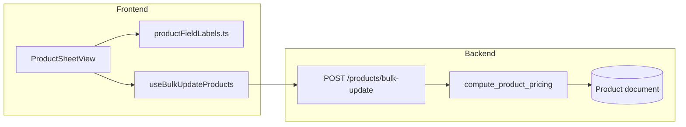

# Products Sheet View — Bulk Edit & Field Sync

## Goals

- Sheet view becomes the primary **bulk edit** surface for Admin and Manager roles.
- **SKU read-only** (per your choice); all other catalog fields editable in bulk edit mode.
- Remove **Copy page** and **Copy all filtered**; keep **Copy selected** and **Create Purchase Order**.
- Introduce **shared, short field labels** consistent with Inventory and Product Form.
- Persist new pricing fields in MongoDB and expose them in API + sheet.

## Architecture



## 1. Shared field labels

Add [`frontend/src/constants/productFieldLabels.ts`](frontend/src/constants/productFieldLabels.ts) as the single source of truth for human-readable column labels (short, consistent):

| API field | Label |
|-----------|-------|
| `sku` | SKU |
| `name` | Name |
| `brand` | Brand |
| `countryOfOrigin` | Country |
| `category` | Category |
| `barcode` | Barcode |
| `supplierId` | Supplier |
| `buyUom` | Buy UOM |
| `uom` | Base UOM |
| `unitsPerBuyUom` | Units/pack |
| `sellMode` | Sell mode |
| `costPrice` | Unit cost |
| *(computed)* | Pack cost |
| `sellingPrice` | Unit price |
| `packSellingPrice` | Pack price |
| `marginPercent` | Margin % |
| `discountedAmount` | Pack savings |
| `discountPercent` | Discount % |
| `offeredPrice` | Offered price |
| `packDiscountPercent` | Pack discount % |
| `packOfferedPrice` | Pack offered price |
| `lowStockThreshold` | Low stock |
| `status` | Status |
| `tags` | Tags |
| `nutritionInfo` | Nutrition |
| `allergenInfo` | Allergens |
| `images` | Images |
| `stock` | Stock |
| `description` | Description |

Reuse [`PO_LABELS`](frontend/src/pages/purchase-orders/poTerminology.ts) for the first PO-paste columns (`Pack qty`, etc.). Update [`ProductFormPage.tsx`](frontend/src/pages/products/ProductFormPage.tsx) labels to import from this file where they overlap (minimal touch — only shared pricing/UOM labels).

**Note:** List view “Discount” chip comes from **promotion rules** (`useDiscountRules`). New product fields use **“Discount %”** / **“Pack discount %”** to avoid confusion.

## 2. Backend — new Product fields

Extend [`backend/app/models/product.py`](backend/app/models/product.py), [`backend/app/schemas/product.py`](backend/app/schemas/product.py), and [`_to_response`](backend/app/routers/products.py):

| Field | Type | Behavior |
|-------|------|----------|
| `margin_percent` | `float` | Stored; recomputed on create/update |
| `discounted_amount` | `float` | Stored; pack bundle savings |
| `discount_percent` | `float` 0–100 | Editable; default `0` |
| `offered_price` | `float` | Stored; synced with unit discount |
| `pack_discount_percent` | `float` 0–100 | Editable; default `0` |
| `pack_offered_price` | `float` | Stored; synced with pack discount |

Add [`backend/app/services/product_pricing.py`](backend/app/services/product_pricing.py) with `compute_product_pricing(product)`:

- **Margin %** (unit): `(selling_price - cost_price) / selling_price * 100` when `selling_price > 0`, else `0`.
- **Pack savings**: `max(0, selling_price * units_per_buy_uom - pack_selling_price)` when pack selling applies (`units_per_buy_uom > 1` and `pack_selling_price > 0`), else `0`.
- **Unit offered price**: if `discount_percent > 0` → `selling_price * (1 - discount_percent/100)`; if user edits `offered_price` directly → back-calculate `discount_percent`.
- **Pack offered price**: same logic using `pack_selling_price` and `pack_discount_percent`.

Call `compute_product_pricing` from:
- `create_product` / `update_product` in [`products.py`](backend/app/routers/products.py)
- New bulk endpoint (below)

Existing documents get values on first update (no migration script required).

## 3. Backend — bulk update endpoint

Add `POST /products/bulk-update` (manager-or-above, same as single PATCH):

```python
class ProductBulkUpdateItem(BaseModel):
    id: str
    # same optional fields as ProductUpdate + new pricing fields
    discount_percent: Optional[float] = None
    offered_price: Optional[float] = None
    pack_discount_percent: Optional[float] = None
    pack_offered_price: Optional[float] = None

class ProductBulkUpdateRequest(BaseModel):
    updates: list[ProductBulkUpdateItem]  # cap e.g. 100 per request
```

- Validate each row (pack price rule, supplier resolution, category sync).
- Apply `compute_product_pricing` before `product.set(...)`.
- Return `{ updated: int, errors: [{ id, detail }] }`.
- Log audit per changed product (reuse `product_snapshot`).

Add tests in `backend/tests/test_products_bulk_update.py`.

## 4. Frontend types & API

- Extend `Product` in [`frontend/src/types/index.ts`](frontend/src/types/index.ts) with the six new fields.
- Add `productService.bulkUpdate(updates)` in [`frontend/src/services/index.ts`](frontend/src/services/index.ts).
- Add `useBulkUpdateProducts` mutation in [`frontend/src/hooks/useProducts.ts`](frontend/src/hooks/useProducts.ts).
- Update mock layer in [`frontend/src/services/mock/`](frontend/src/services/mock/) for local dev parity.

## 5. Sheet column model refactor

Replace the flat header array in [`productPasteExport.ts`](frontend/src/pages/products/productPasteExport.ts) with a structured column config (new file e.g. [`productSheetColumnDefs.ts`](frontend/src/pages/products/productSheetColumnDefs.ts)):

Each column: `{ key, label, editable, readOnly, align, type, poPaste? }`

**Read-only in bulk edit:** SKU, Pack qty (PO default `1`), Pack cost (computed), Margin % (stored but auto-derived — display only), Stock (inventory-managed via Receive/Adjust).

**Editable:** all other fields; supplier as `<Select>` by name; sell mode / status / UOMs as selects; tags/images as comma-separated text; numeric fields with validation.

Expand [`productSheetColumns.ts`](frontend/src/pages/products/productSheetColumns.ts) widths for ~25 columns + horizontal scroll.

Update `productToSheetCells` / copy export to keep **first 6 PO columns** unchanged for PO paste compatibility.

## 6. ProductSheetView bulk-edit UX

In [`ProductSheetView.tsx`](frontend/src/pages/products/components/ProductSheetView.tsx):

**Toolbar changes:**
- Subtitle: bulk-edit focused (still mention PO paste for first columns).
- Remove **Copy page** and **Copy all filtered** buttons and related handlers (`handleCopyPage`, `handleCopyFiltered`, stock-filter copy hint).
- Add **Bulk edit** toggle (visible when `canBulkEdit` prop is true).
- When editing: show **Save changes** / **Cancel**; disable pagination changes while dirty (or warn on navigate).

**Edit mode behavior:**
- Local draft state: `Map<productId, Partial<Product>>` merged over server data.
- Render `TextField` / `Select` in cells when `bulkEditMode === true`.
- On cell change for price/discount pairs, run client-side sync (same formulas as backend) for immediate feedback.
- **Save:** send only dirty rows via `bulkUpdate`; toast success/partial errors; invalidate product queries.
- **Cancel:** discard draft, exit edit mode.

Pass `canBulkEdit={canManage}` from [`ProductsPage.tsx`](frontend/src/pages/products/ProductsPage.tsx) (`isAdminOrManager`).

## 7. Product Form alignment (light touch)

Add the new pricing fields to [`ProductFormPage.tsx`](frontend/src/pages/products/ProductFormPage.tsx) Pricing section:
- Margin %, Pack savings (read-only helpers)
- Discount %, Offered price (unit)
- Pack discount %, Pack offered price

Uses same `compute_product_pricing` logic mirrored in a small frontend util [`frontend/src/utils/productPricing.ts`](frontend/src/utils/productPricing.ts) shared with the sheet.

## 8. Verification

- `npm run build` (frontend)
- Backend tests for pricing computation + bulk update
- Manual: Admin enables bulk edit → change unit price + discount % → save → reload shows persisted margin, offered price, pack fields
- Confirm Copy selected + Create PO still work; PO paste columns unchanged

## Out of scope

- SKU editing (explicitly read-only)
- Stock quantity editing in sheet (use Inventory Receive/Adjust)
- Replacing promotion **DiscountRule** system with product-level discount fields (they coexist; different purposes)
