# KoMart — Technical Documentation

**Version:** 1.1  
**Last Updated:** June 2026  
**Document Owner:** KoMart Engineering  
**Classification:** Internal / Developer Reference

---

## Document Control

| Item | Detail |
|------|--------|
| **Application** | KoMart Retail Management System |
| **Stack** | React 19 + FastAPI + MongoDB (Beanie ODM) |
| **Primary Locale** | Nepal (NPR currency, en-NP formatting) |
| **API Base Path** | `/api/v1` |
| **Assumption** | This document reflects the **current implemented codebase**. Features listed in the product vision but not yet built are marked **(Planned / Not Implemented)**. Phase 2 migration notes: [MIGRATION_PHASE2.md](./MIGRATION_PHASE2.md). |

---

# 1. Executive Summary

## 1.1 Project Overview

**KoMart** is a web-based retail management application designed for a Korean and Asian snacks store (e.g., Thamel, Kathmandu). It unifies point-of-sale (POS), inventory (batch + expiry aware), purchasing, customer loyalty, expenses, and analytics into a single system accessible from desktop browsers.

The system follows a **SPA + REST API** architecture:

- **Frontend:** React 19, TypeScript, Material UI, TanStack Query, Zustand
- **Backend:** FastAPI, Python 3.12, Beanie ODM on MongoDB
- **Auth:** JWT bearer tokens with role-based access control (RBAC)

## 1.2 Business Goals

| Goal | Description |
|------|-------------|
| **Operational efficiency** | Reduce manual stock tracking and speed up checkout |
| **Inventory accuracy** | Batch-level stock with expiry awareness and audit trail |
| **Financial visibility** | Sales, margin, expenses, and purchasing reports |
| **Customer retention** | Loyalty points and membership tiers |
| **Scalable operations** | Support multiple staff roles with least-privilege access |

## 1.3 Objectives

1. Enable cashiers to complete sales in under 60 seconds for typical baskets.
2. Provide managers real-time visibility into low stock, expiring products, and daily revenue.
3. Maintain a complete inventory change history (manual + sales-driven).
4. Support purchase order lifecycle from draft to received with automatic stock updates.
5. Deliver exportable reports for management and accounting review.

## 1.4 Key Features

| Module | Features |
|--------|----------|
| **Authentication** | Email/password login, JWT sessions, 3 roles |
| **Dashboard** | KPI cards, revenue chart, top products, recent sales |
| **POS / Billing** | Product search, cart, promotion rules + manual discounts, cash/eSewa payment, receipt print |
| **Products** | SKU, barcode, categories, pricing, images, supplier linkage, lifecycle status |
| **Inventory** | Batch receive, FEFO deduction, adjust/damaged/correction, movement ledger, history audit |
| **Purchasing** | Suppliers, purchase orders, partial receive |
| **Customers** | Profile, loyalty points, membership tiers, purchase history |
| **Sales** | Transaction ledger, detail view, edit (manager+), reprint |
| **Expenses** | Categorized operating expenses |
| **Reports** | 15+ analytics endpoints with Excel export |
| **Settings** | Store profile (expanded), users (admin), categories, discounts, audit logs |
| **Notifications** | Auto-sync alerts (low stock, expiry, pending POs), notification center UI |

## 1.5 Target Users

| Persona | Primary Activities |
|---------|-------------------|
| **Cashier** | POS, view sales, lookup customers/products |
| **Manager** | Inventory, purchasing, reports, product CRUD, expenses |
| **Admin** | All manager capabilities + user management + store settings |
| **Store Owner / Stakeholder** | Dashboard and reports (read-only via manager/admin account) |

## 1.6 Scope

### In Scope (v1)

- Web application (responsive, desktop-first)
- Single-store operations
- MongoDB Atlas or self-hosted MongoDB
- NPR currency
- Cash and digital wallet payments at POS (UI: Cash, eSewa)
- Batch inventory with expiry dates
- Stock adjustment audit log

### Out of Scope (v1)

- Multi-store / multi-warehouse
- Native mobile apps
- Offline POS mode
- Payment gateway integration (live card/eSewa API)
- Email/SMS notifications
- Forgot-password / self-service account recovery
- Dedicated Inventory Staff or Viewer roles *(see Section 10)*

## 1.7 Assumptions

1. Users have reliable internet and modern browsers (Chrome, Edge, Firefox).
2. One MongoDB database per deployment environment.
3. Product `stock` field is a **cached aggregate** of active batch quantities.
4. Tax rate is configurable in settings; POS currently submits `tax: 0` *(implementation detail — see Billing module)*.
5. Barcode scanning uses keyboard-wedge scanners (input into search field).
6. Timestamps are stored in UTC; UI formats for local display.
7. Soft deletes are used for products, users, and categories (`is_active: false`).

## 1.8 Constraints

| Constraint | Impact |
|------------|--------|
| MongoDB document model | Embedded line items (transactions, POs); no relational joins |
| JWT statelessness | Token revocation requires short expiry or future blocklist |
| Serverless cold starts | If deployed on Vercel/serverless, DB init must be lazy |
| Browser print | Receipt printing depends on pop-up/print permissions |
| 3 roles only | Fine-grained permissions require future permission matrix |

---

# 2. Functional Requirements

## 2.1 Authentication

| Attribute | Detail |
|-----------|--------|
| **Purpose** | Secure access; issue short-lived JWT + long-lived refresh token |
| **Inputs** | Email, password (login); refresh token (refresh/logout) |
| **Outputs** | `accessToken`, `refreshToken`, `expiresIn`, `tokenType`, `user` |
| **Business Rules** | Inactive users cannot authenticate; refresh tokens stored hashed; rotation on refresh; reuse revokes family |
| **Validation** | Valid email format; password required (min 1 char on frontend) |
| **Permissions** | Login/refresh: public; logout: refresh token or access token |

**Token lifetimes (defaults):** Access 15 minutes; refresh 7 days.

**Removed:** Forgot-password flow (intentionally not implemented in v1).

See also: [MIGRATION_REFRESH_TOKENS.md](./MIGRATION_REFRESH_TOKENS.md)

---

## 2.2 Dashboard

| Attribute | Detail |
|-----------|--------|
| **Purpose** | At-a-glance store performance and quick navigation |
| **Inputs** | Optional date range (admin/manager) |
| **Outputs** | Stats, revenue time series, top products, recent transactions |
| **Business Rules** | Stats derived from transactions, products, inventory batches |
| **Validation** | Date range must be valid ISO dates when provided |
| **Permissions** | All authenticated roles |

**KPIs displayed:** Today's/weekly/monthly sales, product count, low stock, expiring items, inventory value, customer count.

---

## 2.3 Inventory

| Attribute | Detail |
|-----------|--------|
| **Purpose** | Track stock per product and batch; audit all quantity changes |
| **Inputs** | Receive batch (product, batch number, qty, expiry), adjust stock (type, qty, reason), filters |
| **Outputs** | Inventory list, stats, batch detail, adjustment history, **movement ledger** |
| **Business Rules** | Batches are source of truth; FEFO on sales; adjustments logged with before/after; movements link to sales/POs via `reference_type` / `reference_id` |
| **Validation** | Receive qty ≥ 1; adjust qty ≠ 0; reason required on adjust |
| **Permissions** | View: all authenticated; Write: manager, admin |

**Adjustment types:** `adjustment`, `damaged`, `correction`, `sale`, `receive`

---

## 2.4 Billing (POS)

| Attribute | Detail |
|-----------|--------|
| **Purpose** | Checkout, payment confirmation, receipt generation |
| **Inputs** | Cart items, customer (optional), discounts, payment method, cash tendered |
| **Outputs** | Transaction record, printable receipt, stock deductions |
| **Business Rules** | Stock checked before sale; discontinued products blocked; loyalty points earned/redeemed; promotions re-evaluated server-side on checkout; txn number uses configurable prefix |
| **Validation** | Cash tendered ≥ total for cash payments; non-empty cart |
| **Permissions** | All authenticated roles |

---

## 2.5 Sales

| Attribute | Detail |
|-----------|--------|
| **Purpose** | Historical sales ledger and detail view |
| **Inputs** | Filters: date range, payment method, search, pagination |
| **Outputs** | Paginated transaction list, single transaction detail |
| **Business Rules** | Cashiers see **only their own** transactions (`cashier_id` filter) |
| **Validation** | Standard pagination bounds |
| **Permissions** | List/detail: authenticated; cashiers scoped to own sales |

---

## 2.6 Purchases (Purchase Orders)

| Attribute | Detail |
|-----------|--------|
| **Purpose** | Procure stock from suppliers with receive workflow |
| **Inputs** | Supplier, line items, expected delivery, status updates, receive quantities |
| **Outputs** | PO record, inventory batches on receive |
| **Business Rules** | Status: draft → ordered → partial → received; receive creates batches |
| **Validation** | Cannot edit non-draft POs; receive qty ≤ remaining |
| **Permissions** | Manager, admin |

---

## 2.7 Customer Management

| Attribute | Detail |
|-----------|--------|
| **Purpose** | CRM-lite with loyalty program |
| **Inputs** | Name, phone, email, birthday (optional) |
| **Outputs** | Customer profile, tier, points, transaction history |
| **Business Rules** | Points earned: `floor(total / 100)`; tiers by lifetime spend |
| **Validation** | Name and phone required on create |
| **Permissions** | All authenticated roles |

**Membership tiers:** Bronze (&lt;25k NPR), Silver (25k+), Gold (50k+), Platinum (100k+)

---

## 2.8 Supplier Management

| Attribute | Detail |
|-----------|--------|
| **Purpose** | Maintain supplier master data for purchasing |
| **Inputs** | Name, country, contact, phone, email, address |
| **Outputs** | Supplier list and detail |
| **Business Rules** | Linked to products and POs |
| **Validation** | Required fields per schema |
| **Permissions** | View: authenticated; Write: manager, admin |

---

## 2.9 Product Management

| Attribute | Detail |
|-----------|--------|
| **Purpose** | Product catalog for POS and inventory |
| **Inputs** | SKU, barcode, name, brand, category, prices, supplier, images, thresholds |
| **Outputs** | Product list, detail, CRUD responses |
| **Business Rules** | Soft delete (`is_active`); lifecycle **status** (`active`, `seasonal`, `discontinued`); unique SKU; stock synced from batches; POS uses `sellable_only` (active + seasonal) |
| **Validation** | Positive prices; unique SKU |
| **Permissions** | View: all; Write: manager, admin; cost price hidden from cashiers in UI |

---

## 2.10 Reports

| Attribute | Detail |
|-----------|--------|
| **Purpose** | Analytics for management decisions |
| **Inputs** | Date range, optional filters |
| **Outputs** | Aggregated metrics, chart data, tabular data, Excel export |
| **Business Rules** | Manager+ only at API level |
| **Validation** | Valid date range |
| **Permissions** | Manager, admin |

---

## 2.11 User Management

| Attribute | Detail |
|-----------|--------|
| **Purpose** | Staff account lifecycle |
| **Inputs** | Name, email, password, role |
| **Outputs** | User list, profile updates |
| **Business Rules** | Soft deactivate; admin-only CRUD |
| **Validation** | Unique email; valid role enum |
| **Permissions** | Admin only (Settings → Users tab) |

---

## 2.12 Settings

| Attribute | Detail |
|-----------|--------|
| **Purpose** | Store configuration and reference data |
| **Inputs** | Store name, address, tax, loyalty, POS/receipt, inventory defaults, prefixes, appearance; category CRUD; discount rule CRUD |
| **Outputs** | `StoreSettings` singleton, category list, discount rules |
| **Business Rules** | One settings document; category soft delete (admin); discount rules prioritized; receipt branding drives print/PDF |
| **Validation** | Per Pydantic schemas |
| **Permissions** | Read: authenticated; Store PATCH: admin; Categories + Discounts: manager+ write; category delete: admin |

---

## 2.13 Discounts & Promotions

| Attribute | Detail |
|-----------|--------|
| **Purpose** | Configurable promotion rules applied at POS checkout |
| **Inputs** | Rule type, value, product/category scope, optional coupon code, date range, priority |
| **Outputs** | Evaluated line + cart discounts; persisted on transaction |
| **Business Rules** | Server re-evaluates on sale create; manual cart discount stacks on top; discontinued products excluded |
| **Validation** | Positive values; unique optional coupon codes |
| **Permissions** | CRUD: manager+; evaluate: authenticated (POS) |

---

## 2.14 Notifications

| Attribute | Detail |
|-----------|--------|
| **Purpose** | In-app alerts for operational issues |
| **Inputs** | Auto-sync from inventory/PO state; manual seed (system type) |
| **Outputs** | Notification list with read state and deep links |
| **Business Rules** | Auto alerts deduplicated via `source_key`; stale auto alerts removed when condition clears; expiry window from `expiry_warning_days` setting |
| **Validation** | Standard enum types |
| **Permissions** | All authenticated roles (read + mark read) |

---

# 3. System Architecture

## 3.1 High-Level Architecture

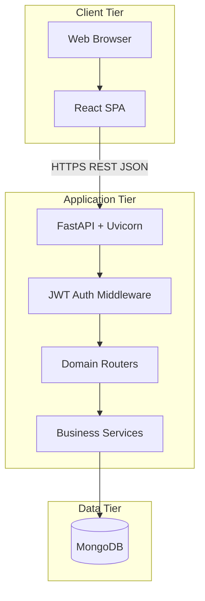

## 3.2 Frontend Architecture

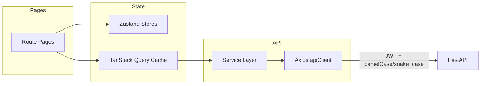

**Layers:**

| Layer | Responsibility |
|-------|----------------|
| **Pages** | Route-level composition, forms, tables |
| **Components** | Reusable UI (DataTable, PaymentModal, StatCard) |
| **Hooks** | React Query wrappers per domain |
| **Services** | API method definitions |
| **Store** | Auth, theme, cart, UI, global loading |
| **Utils** | Formatting, role helpers |

## 3.3 Backend Architecture

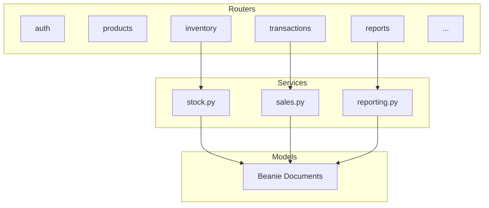

**Patterns:**

- Thin routers (HTTP + validation + auth)
- Fat services for stock and sales (transactions, compensating rollback)
- Pydantic schemas for request/response DTOs
- Beanie for async MongoDB access

## 3.4 Database Architecture

- **Type:** Document-oriented (MongoDB)
- **ODM:** Beanie (Pydantic-based)
- **Collections:** 12 primary document types (see Section 5)
- **Indexing:** Unique on `users.email`, `products.sku`, `transactions.transaction_number`, `categories.name`; compound indexes on inventory batches and stock adjustments
- **Embedded documents:** `TransactionItem`, `PurchaseOrderItem`

## 3.5 API Architecture

| Aspect | Standard |
|--------|----------|
| **Style** | REST over JSON |
| **Versioning** | URL prefix `/api/v1` |
| **Naming** | snake_case on wire; frontend converts to camelCase |
| **Pagination** | `page`, `page_size`, response includes `total`, `total_pages` |
| **Errors** | FastAPI `detail` string or validation array |
| **Auth header** | `Authorization: Bearer <token>` |

## 3.6 Authentication Flow

### Login

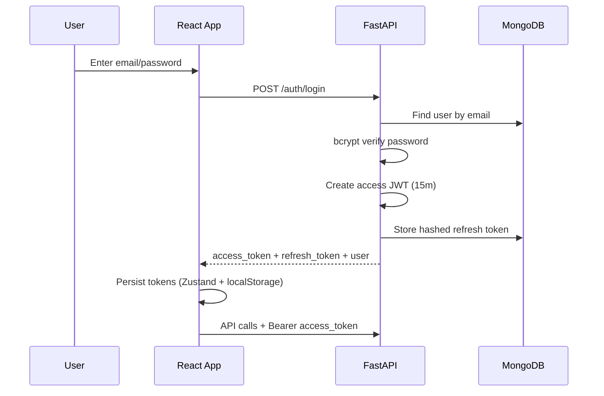

### Automatic refresh on 401

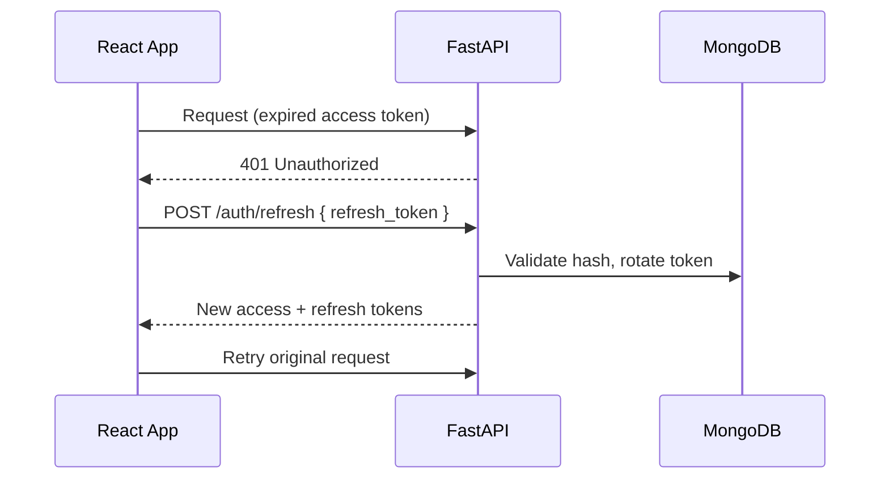

### Logout

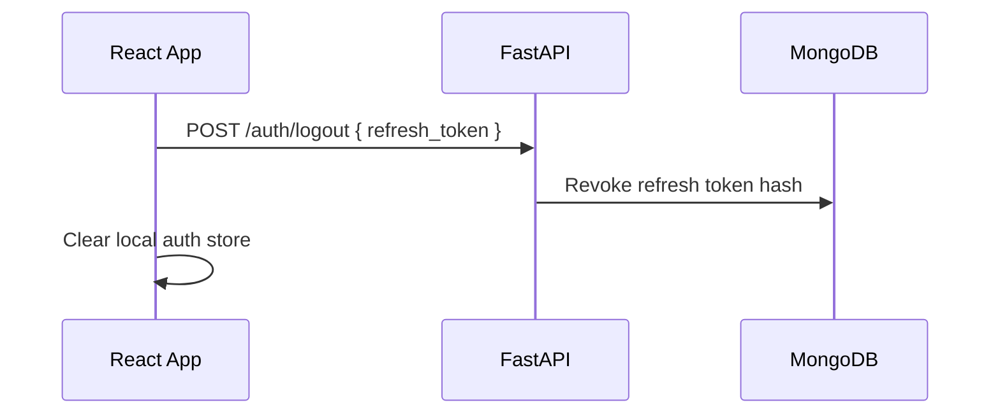

## 3.7 Deployment Architecture

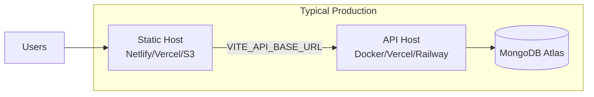

| Component | Options |
|-----------|---------|
| **Frontend** | `npm run build` → static `dist/`; SPA rewrite rules required |
| **Backend** | Docker (`backend/Dockerfile`) → Uvicorn :8000 |
| **Database** | MongoDB Atlas or `docker-compose` local MongoDB |
| **Env config** | `.env` per environment (see Section 14) |

---

# 4. Application Flowcharts

## 4.1 User Login

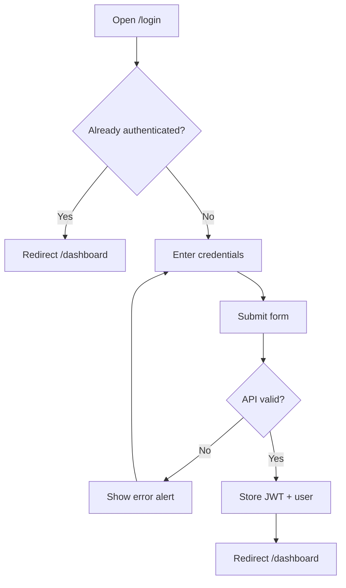

## 4.2 Product Management

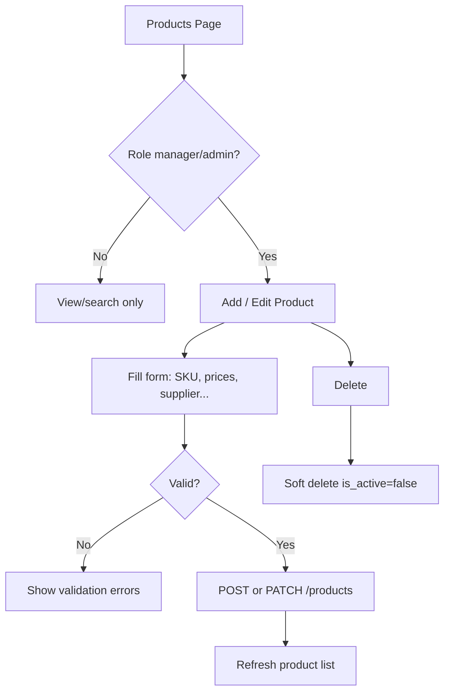

## 4.3 Purchase Workflow

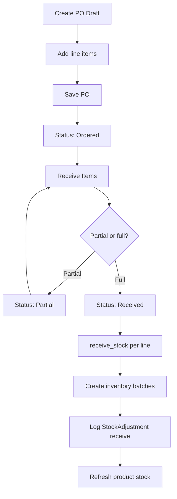

## 4.4 Inventory Update (Receive)

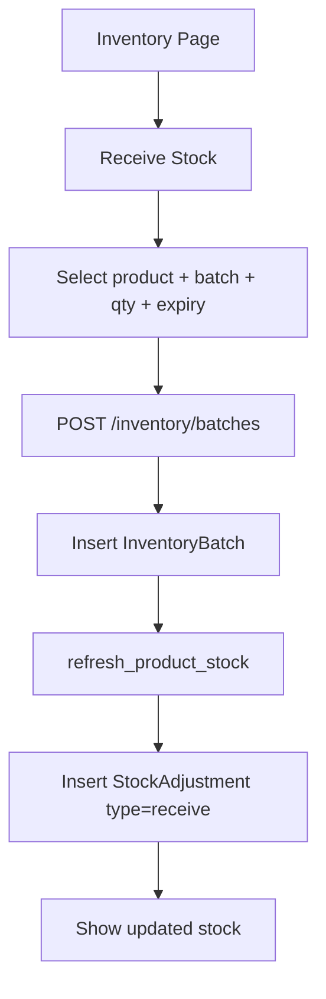

## 4.5 Sales Workflow (POS)

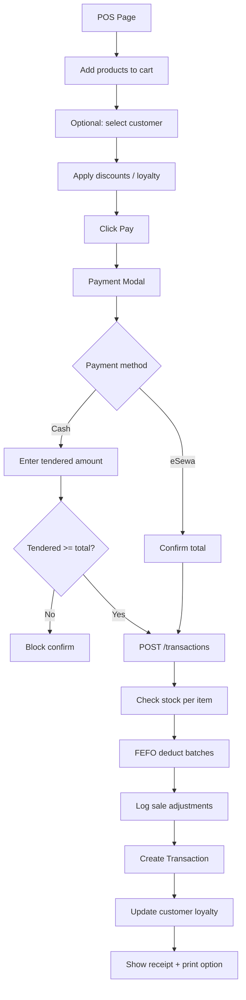

## 4.6 Billing Process

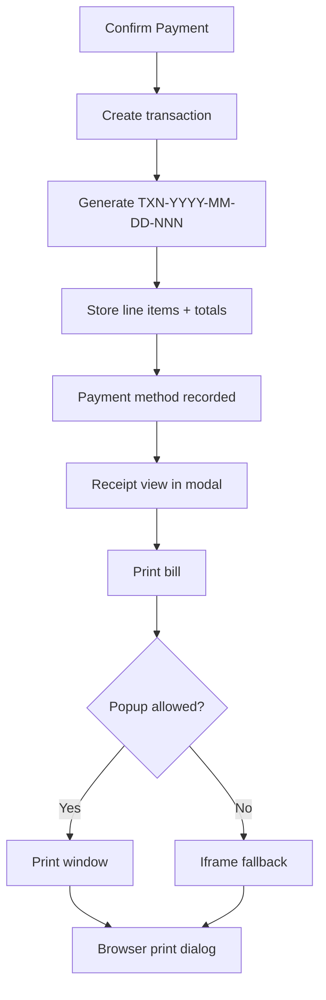

## 4.7 Stock Adjustment

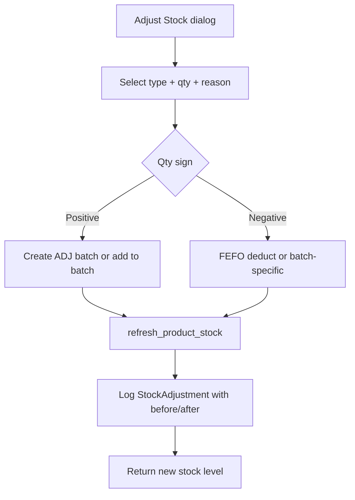

## 4.8 Report Generation

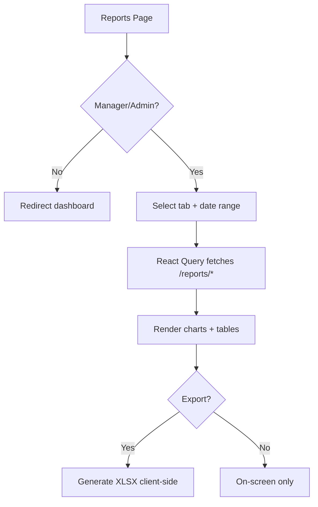

## 4.9 User Management

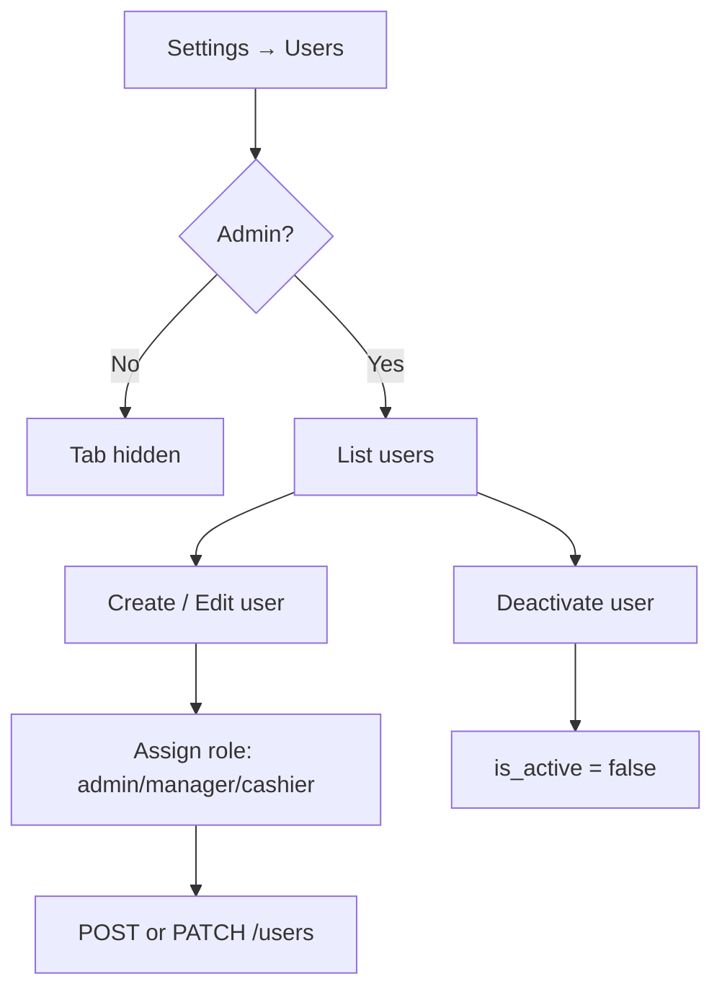

## 4.10 Complete System Workflow

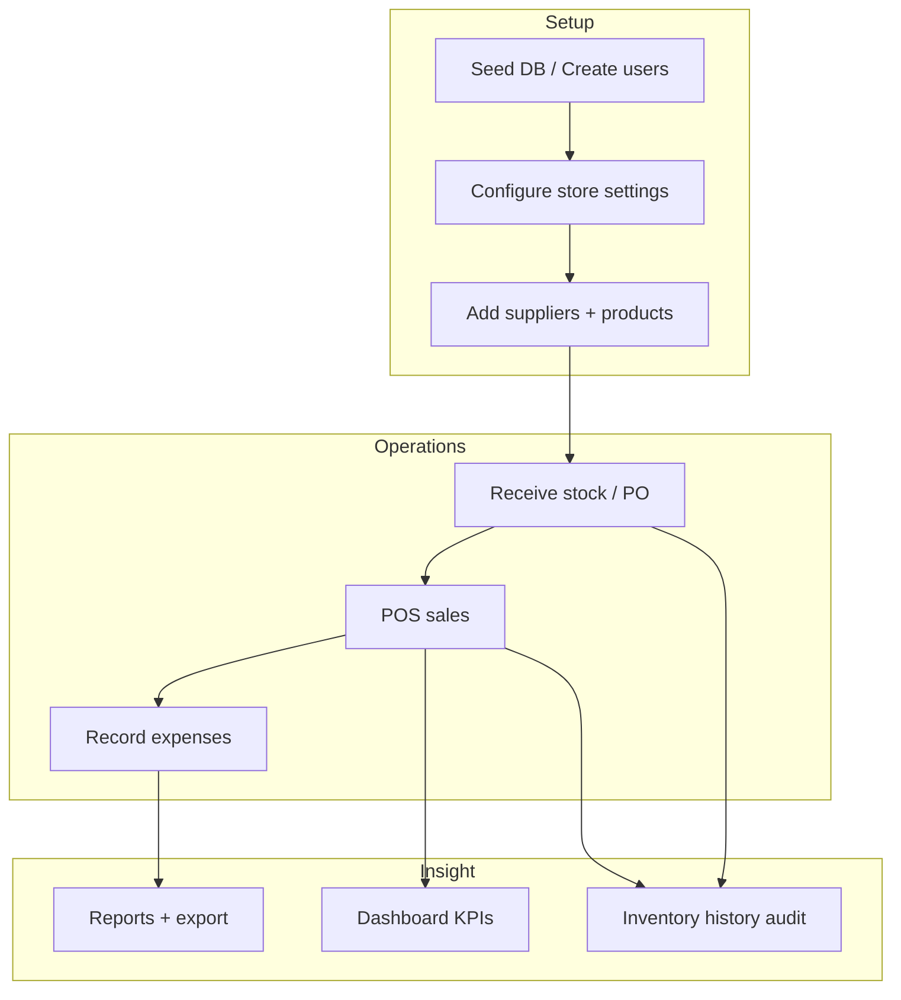

---

# 5. Database Design

## 5.1 Entity Relationship Diagram

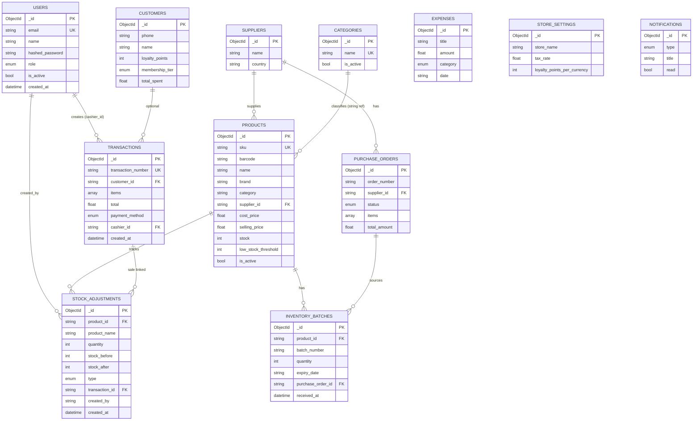

> **Note:** `FK` relationships are **logical** (string `ObjectId` references), not enforced by MongoDB foreign keys.

---

## 5.2 Collection Schemas

### 5.2.1 Users (`users`)

| Field | Type | Required | Default | Validation | Index |
|-------|------|----------|---------|------------|-------|
| `email` | string | Yes | — | Unique, valid email | Unique |
| `name` | string | Yes | — | — | — |
| `hashed_password` | string | Yes | — | bcrypt hash | — |
| `role` | enum | Yes | `cashier` | `admin`, `manager`, `cashier` | — |
| `avatar` | string | No | null | URL/path | — |
| `is_active` | bool | Yes | `true` | — | — |
| `created_at` | datetime | Yes | UTC now | — | — |

**Purpose:** Staff authentication and RBAC.

---

### 5.2.2 Roles *(Not a separate collection)*

Roles are stored as `User.role` enum. There is **no** `roles` collection in v1.

| Role | Description |
|------|-------------|
| `admin` | Full system access |
| `manager` | Operations + reports, no user/settings admin |
| `cashier` | POS-focused, read-only catalog |

---

### 5.2.3 Products (`products`)

| Field | Type | Required | Default | Validation | Index |
|-------|------|----------|---------|------------|-------|
| `name` | string | Yes | — | — | — |
| `sku` | string | Yes | — | Unique | Unique |
| `barcode` | string | Yes | — | — | Indexed |
| `brand` | string | Yes | — | — | — |
| `country_of_origin` | string | Yes | — | — | — |
| `category` | string | Yes | — | — | Indexed |
| `supplier_id` | string | Yes | — | Valid supplier ref | — |
| `supplier_name` | string | Yes | Denormalized | — | — |
| `description` | string | No | `""` | — | — |
| `uom` | string | Yes | `pcs` | — | — |
| `cost_price` | float | Yes | — | ≥ 0 | — |
| `selling_price` | float | Yes | — | ≥ 0 | — |
| `images` | string[] | No | `[]` | — | — |
| `nutrition_info` | string | No | null | — | — |
| `allergen_info` | string | No | null | — | — |
| `stock` | int | Yes | `0` | Cached sum | — |
| `low_stock_threshold` | int | Yes | `10` | — | — |
| `status` | enum | Yes | `active` | `active`, `seasonal`, `discontinued` | — |
| `is_active` | bool | Yes | `true` | Soft delete flag | — |
| `created_at` / `updated_at` | datetime | Yes | UTC now | — | — |

**Purpose:** Sellable item master data.

**Relationships:** → `suppliers`, → `inventory_batches`, → embedded in `transactions.items`

---

### 5.2.4 Categories (`categories`)

| Field | Type | Required | Default | Index |
|-------|------|----------|---------|-------|
| `name` | string | Yes | — | Unique |
| `description` | string | No | `""` | — |
| `is_active` | bool | Yes | `true` | — |
| `created_at` | datetime | Yes | UTC now | — |

**Purpose:** Product classification (also mirrored in frontend `PRODUCT_CATEGORIES` constant for filters).

---

### 5.2.5 Brands *(Not a separate collection)*

Brand is a **string field** on `Product.brand`. No dedicated brands table.

---

### 5.2.6 Suppliers (`suppliers`)

| Field | Type | Required |
|-------|------|----------|
| `name` | string | Yes |
| `country` | string | Yes |
| `contact_person` | string | Yes |
| `phone` | string | Yes |
| `email` | string | No |
| `address` | string | Yes |
| `created_at` | datetime | Yes |

---

### 5.2.7 Customers (`customers`)

| Field | Type | Required | Default |
|-------|------|----------|---------|
| `name` | string | Yes | — |
| `phone` | string | Yes | Indexed |
| `email` | string | No | `""` |
| `birthday` | string | No | ISO date |
| `loyalty_points` | int | Yes | `0` |
| `membership_tier` | enum | Yes | `bronze` |
| `total_spent` | float | Yes | `0` |
| `created_at` | datetime | Yes | UTC now |

---

### 5.2.8 Inventory Batches (`inventory_batches`)

| Field | Type | Required | Purpose |
|-------|------|----------|---------|
| `product_id` | string | Yes | Product reference |
| `batch_number` | string | Yes | Lot identifier |
| `quantity` | int | Yes | Current batch qty |
| `expiry_date` | string | No | ISO date `YYYY-MM-DD` |
| `purchase_order_id` | string | No | PO linkage |
| `received_at` | datetime | Yes | Receipt timestamp |

**Indexes:** `(product_id, expiry_date)`, `(expiry_date)`

---

### 5.2.9 Purchase Orders (`purchase_orders`)

| Field | Type | Required |
|-------|------|----------|
| `order_number` | string | Yes |
| `supplier_id` / `supplier_name` | string | Yes |
| `status` | enum | Yes (`draft`) |
| `items` | array | Yes |
| `total_amount` | float | Yes |
| `expected_delivery` | string | No |
| `ordered_by` / `received_by` | string | No |
| `received_date` | string | No |
| `created_at` / `updated_at` | datetime | Yes |

**Embedded `PurchaseOrderItem`:**

| Field | Type |
|-------|------|
| `product_id` | string |
| `product_name` | string |
| `quantity` | int |
| `unit_cost` | float |
| `received_quantity` | int (default 0) |

---

### 5.2.10 Sales / Transactions (`transactions`)

| Field | Type | Required |
|-------|------|----------|
| `transaction_number` | string | Yes, unique |
| `customer_id` | string | No |
| `customer_name` | string | No |
| `items` | array | Yes |
| `subtotal` | float | Yes |
| `discount` | float | Yes | Total discount (promotion + manual + loyalty) |
| `promotion_discount` | float | No | `0` | Auto-applied rule discounts |
| `manual_discount` | float | No | `0` | Cashier-entered cart discount |
| `applied_promotions` | array | No | `[]` | `{ rule_id, name, amount }` |
| `coupon_code` | string | No | `""` | Coupon used at checkout |
| `tax` | float | Yes |
| `loyalty_points_redeemed` | int | Yes |
| `total` | float | Yes |
| `payment_method` | enum | Yes |
| `created_by` | string | Yes |
| `cashier_id` | string | No |
| `created_at` | datetime | Yes |

**Embedded `TransactionItem`:** `product_id`, `name`, `sku`, `price`, `quantity`, `discount`

---

### 5.2.11 Payments *(Not a separate collection)*

Payment data lives on `Transaction.payment_method`. No partial payment or refund documents in v1.

---

### 5.2.12 Expenses (`expenses`)

| Field | Type | Required |
|-------|------|----------|
| `title` | string | Yes |
| `description` | string | No |
| `amount` | float | Yes (≥ 0) |
| `category` | enum | Yes |
| `date` | string | Yes (ISO date) |
| `paid_to` | string | No |
| `payment_method` | string | No |
| `is_setup_cost` | bool | Yes |
| `created_at` / `updated_at` | datetime | Yes |

---

### 5.2.13 Stock Movements (`stock_adjustments`)

| Field | Type | Required | Default |
|-------|------|----------|---------|
| `product_id` | string | Yes | — |
| `product_sku` | string | No | `""` | Denormalized SKU |
| `product_name` | string | No | `""` |
| `batch_id` | string | No | — |
| `transaction_id` | string | No | — |
| `reference_type` | string | No | `""` | e.g. `sale`, `purchase_order`, `receive` |
| `reference_id` | string | No | `""` | Linked sale/PO/batch id |
| `type` | enum | Yes | — |
| `quantity` | int | Yes | +/- change |
| `stock_before` | int | No | `0` |
| `stock_after` | int | No | `0` |
| `reason` | string | Yes | — |
| `created_by` | string | Yes | — |
| `created_at` | datetime | Yes | UTC now |

**Indexes:** `(product_id, created_at DESC)`, `(transaction_id)`, `(reference_type, reference_id)`

**Movement ledger API:** `GET /inventory/movements` (store-wide, filterable) and `GET /inventory/movements/summary`. Legacy per-product history: `GET /inventory/history`.

---

### 5.2.14 Discount Rules (`discount_rules`)

| Field | Type | Required | Notes |
|-------|------|----------|-------|
| `name` | string | Yes | Display name |
| `code` | string | No | Optional coupon code |
| `rule_type` | enum | Yes | See Section 7.2 |
| `value` | float | Yes | Percent or flat amount |
| `product_id` | string | No | For product-scoped rules |
| `category` | string | No | For category-scoped rules |
| `min_cart_total` | float | No | `0` |
| `max_discount` | float | No | `0` = no cap |
| `starts_at` / `ends_at` | datetime | No | Optional validity window |
| `is_active` | bool | Yes | `true` |
| `priority` | int | Yes | Higher evaluated first |
| `created_at` / `updated_at` | datetime | Yes | UTC |

**API:** `GET/POST/PATCH/DELETE /discounts`, `POST /discounts/evaluate`. Frontend: Settings → Discounts tab (manager+).

---

### 5.2.18 Refresh Tokens (`refresh_tokens`)

| Field | Type | Required | Notes |
|-------|------|----------|-------|
| `user_id` | string | Yes | User reference |
| `token_hash` | string | Yes | SHA-256 of plain token (unique) |
| `family_id` | string | Yes | Rotation family |
| `device_label` | string | No | Truncated UA |
| `user_agent` | string | No | Client UA |
| `ip_address` | string | No | Client IP |
| `expires_at` | datetime | Yes | Default +7 days |
| `revoked_at` | datetime | No | Set on logout/rotation |
| `replaced_by_hash` | string | No | Previous token chain |
| `created_at` | datetime | Yes | UTC |

**Purpose:** Multi-device session management with refresh token rotation.

---

### 5.2.15 Audit Logs

Collection: `audit_logs` — centralized security and compliance trail (complements per-product `stock_adjustments`).

| Field | Type | Description |
|-------|------|-------------|
| `user_id` | string | Acting user ID (empty for anonymous) |
| `user_name` | string | Display name at time of action |
| `user_email` | string | Email at time of action |
| `module` | enum | `auth`, `products`, `inventory`, `sales`, `purchase_orders`, `settings`, `users` |
| `action` | string | e.g. `login`, `create`, `update`, `price_change`, `receive`, `adjust` |
| `entity_type` | string | e.g. `product`, `transaction`, `user` |
| `entity_id` | string | Target document ID |
| `previous_value` | object | Sanitized before-state |
| `new_value` | object | Sanitized after-state |
| `ip_address` | string | Client IP (`X-Forwarded-For` aware) |
| `user_agent` | string | Raw UA (max 512 chars) |
| `browser` | string | Parsed browser name |
| `device` | string | `Desktop`, `Mobile`, or `Tablet` |
| `request_id` | string | Correlation ID (`X-Request-ID` middleware) |
| `created_at` | datetime | UTC timestamp |

**Indexes:** `created_at`, `module+created_at`, `user_id+created_at`, `entity_type+entity_id`, `action+created_at`, `request_id`.

**Service:** `app/services/audit.py` — `log_audit()`, `request_meta()`, snapshot helpers, password/token redaction.

**API:** `GET /audit-logs`, `GET /audit-logs/{id}` (manager+). Frontend: Settings → Audit Logs tab.

---

### 5.2.16 Settings (`store_settings`)

Singleton document:

| Field | Type | Default |
|-------|------|---------|
| `store_name` | string | `KoMart` |
| `address` | string | `""` |
| `phone` | string | `""` |
| `email` | string | `""` |
| `logo_url` | string | `""` |
| `pan` | string | `""` |
| `vat_number` | string | `""` |
| `currency` | string | `NPR` |
| `tax_rate` | float | `13.0` |
| `tax_inclusive` | bool | `false` |
| `receipt_header` | string | `""` |
| `receipt_footer` | string | `""` |
| `auto_print` | bool | `false` |
| `default_payment_method` | string | `cash` |
| `default_low_stock_threshold` | int | `10` |
| `expiry_warning_days` | int | `30` |
| `auto_sku` | bool | `false` |
| `barcode_format` | string | `any` |
| `loyalty_points_per_currency` | int | `100` |
| `loyalty_redeem_rate` | int | `1` |
| `transaction_prefix` | string | `TXN` |
| `purchase_order_prefix` | string | `PO` |
| `date_format` | string | `en-US` |
| `time_format` | string | `12h` |

**API:** `GET /settings`, `PATCH /settings` (admin write). Service: `app/services/store_settings.py`.

---

### 5.2.17 Notifications (`notifications`)

| Field | Type |
|-------|------|
| `type` | enum: `low_stock`, `expiry`, `purchase_reminder`, `system` |
| `title`, `message` | string |
| `read` | bool |
| `link` | string (optional) |
| `source_key` | string (optional) | Dedup key for auto alerts (`auto:…`) |
| `created_at` | datetime |

**Sync:** `sync_notifications()` on list (default) or `POST /notifications/sync`. Auto-generates low-stock, expiry summary, and pending PO alerts.

**API:** `GET /notifications`, `PATCH /notifications/{id}/read`, `PATCH /notifications/read-all`. Frontend: top-bar drawer + `/notifications` page.

---

# 6. Inventory Management Documentation

## 6.1 Inventory Lifecycle

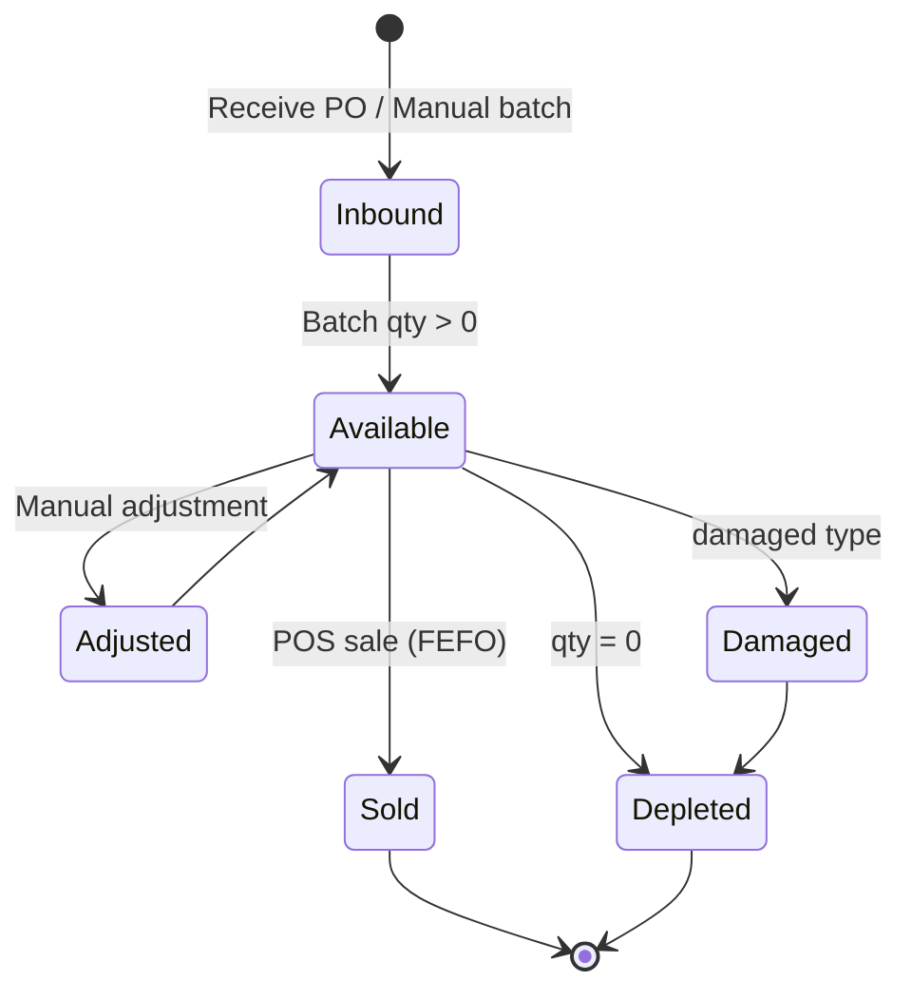

1. **Inbound:** PO receive or manual batch receive → `InventoryBatch` created.
2. **Available:** `Product.stock` = sum of batch quantities.
3. **Outbound:** Sales deduct via FEFO; logged in `stock_adjustments`.
4. **Adjustments:** Manual corrections, damage write-offs.

## 6.2 Stock In

| Method | Trigger | API |
|--------|---------|-----|
| PO Receive | Manager receives PO lines | `POST /purchase-orders/{id}/receive` |
| Manual Receive | Inventory → Receive dialog | `POST /inventory/batches` |

Both call `receive_stock()` → batch insert → stock refresh → audit log (`type=receive`).

## 6.3 Stock Out

| Method | Trigger | Mechanism |
|--------|---------|-----------|
| POS Sale | Transaction create | `deduct_stock_fefo()` |
| Negative adjustment | Inventory adjust | FEFO or batch-specific |

## 6.4 Returns

**(Planned / Not Implemented)** — No return/refund transaction type or restock workflow in v1.

## 6.5 Damaged Products

Use **Stock Adjustment** with `type: damaged` and negative quantity. Reason field documents incident.

## 6.6 Expired Products

- Identified via `expiry_date` on batches and `expiring` inventory filter (30-day window).
- Disposal via damaged/adjustment adjustment (manual process).

## 6.7 Low Stock

- **Rule:** `0 < stock ≤ low_stock_threshold`
- **Surfaces:** Dashboard stat, inventory filter tab, reports (`/reports/low-stock`)

## 6.8 Reorder Levels

`Product.low_stock_threshold` per SKU (default 10). No automatic PO generation **(Planned / Not Implemented)**.

## 6.9 Stock Transfers

**(Planned / Not Implemented)** — Single-store model; no inter-location transfers.

## 6.10 Inventory Adjustment

| Type | Use Case |
|------|----------|
| `adjustment` | General stock correction |
| `damaged` | Spoilage, breakage |
| `correction` | Count reconciliation |
| `receive` | System-generated on inbound |
| `sale` | System-generated on POS sale |

API: `POST /inventory/adjust`  
History: `GET /inventory/history`

## 6.11 Stock Valuation

**Method:** `Inventory Value = Σ (product.stock × product.cost_price)`

Used in dashboard and `/reports/inventory-summary`. Batch-level cost averaging is **not** implemented; product-level `cost_price` is used.

## 6.12 FIFO / LIFO / Weighted Average — Recommendation

| Method | Status | Recommendation |
|--------|--------|----------------|
| **FEFO** (First Expiry, First Out) | **Implemented** for sales deduction | **Keep as primary** for perishable snacks |
| FIFO | Not implemented | Optional future enhancement |
| LIFO | Not recommended | Poor fit for expiry-driven retail |
| Weighted Average Cost | Not implemented | Consider for COGS reporting if batch costs diverge |

**Rationale:** FEFO minimizes expired stock waste for food products. Cost reporting uses product `cost_price`, not batch landed cost.

## 6.13 Barcode Support

- `Product.barcode` field stored and searchable.
- POS search accepts barcode via keyboard-wedge scanner (types into search field).
- Dedicated camera scanner UI **(Planned / Not Implemented)**.

## 6.14 SKU Generation

- SKU is required and unique on product form.
- **Auto-SKU** optional via Settings → `auto_sku`: generates SKU from brand + category when both are set (new products only).
- Manual regenerate button remains on product form.

## 6.15 Batch Tracking

- Every inbound creates `InventoryBatch` with `batch_number`.
- PO receives auto-generate `PO-{order_number}-{seq}`.
- Manual adjustments may create `ADJ-{timestamp}` batches.

## 6.16 Expiry Tracking

- Optional `expiry_date` per batch (ISO date string).
- FEFO sort: earliest expiry consumed first; null expiry consumed last.
- Reports: `/reports/expiring-products` (`within_days` query param; frontend uses `expiry_warning_days` from settings)

## 6.17 Inventory Reports & Movement Ledger

| Report / View | Endpoint / UI |
|---------------|---------------|
| Inventory summary | `/reports/inventory-summary` |
| Low stock | `/reports/low-stock` (optional `product_status` filter) |
| Expiring products | `/reports/expiring-products` |
| Dead stock | `/reports/dead-stock` |
| Change history (legacy) | `/inventory/history` |
| **Movement ledger** | `GET /inventory/movements`, `GET /inventory/movements/summary` |
| Movement ledger UI | Inventory → **Movement Ledger** tab; product detail scoped view |

---

# 7. Billing Module

## 7.1 Invoice Creation

POS checkout creates a `Transaction` document (serves as invoice/receipt).

- **Number format:** `{transaction_prefix}-{YYYY-MM-DD}-{NNN}` (prefix from settings, default `TXN`)
- **Line items:** Embedded with price, qty, per-line discount

## 7.2 Discounts

| Type | Implementation |
|------|----------------|
| **Promotion rules** | `discount_rules` — product/category/cart percent or flat; optional coupon; priority + date range |
| **POS evaluation** | `POST /discounts/evaluate` on cart change; server re-evaluates on checkout |
| **Manual cart discount** | Flat or percentage in POS cart (stacks on promotions) |
| **Loyalty redemption** | Points converted to discount |
| **Line-item discount** | Per-line from promotion evaluation; embedded on transaction items |

**Transaction fields:** `promotion_discount`, `manual_discount`, `applied_promotions`, `coupon_code`, `discount` (total).

## 7.3 Taxes

- `StoreSettings.tax_rate` default 13% (Nepal VAT reference).
- `tax_inclusive` flag available.
- **Current POS behavior:** submits `tax: 0` — tax display/calculation on receipt is **(Gap — configure in future sprint)**.

## 7.4 Payment Methods

| Method | Backend Enum | POS UI |
|--------|--------------|--------|
| Cash | `cash` | ✓ |
| eSewa | `esewa` | ✓ |
| Card | `card` | Not in POS UI |
| Khalti | `khalti` | Not in POS UI |

## 7.5 Refunds

**(Planned / Not Implemented)**

## 7.6 Partial Payments

**(Planned / Not Implemented)** — Full payment required at checkout.

## 7.7 Invoice Status

Transactions are immutable once created. No `draft`/`void`/`refunded` status enum **(Planned / Not Implemented)**.

## 7.8 Receipt Printing

| Capability | Implementation |
|------------|----------------|
| **On-screen preview** | `ReceiptView` component (store branding from settings) |
| **Print / Reprint** | `ReceiptActions` → `printTransactionReceipt()` |
| **Download PDF** | jsPDF 80mm thermal layout (`downloadReceiptPdf`) |
| **Download HTML** | Standalone `.html` receipt (`downloadReceiptHtml`) |

**Print engine** (`frontend/src/utils/receiptPrint.ts`):

1. Builds full HTML document with thermal CSS (`@page size: 80mm auto`)
2. Opens via **blob URL** (fixes blank/white print window)
3. Falls back to hidden **iframe** if pop-ups blocked
4. Waits for document load + `requestAnimationFrame` before `print()`

**UI locations:** Payment success modal (Print + PDF), Sale detail page (Reprint + PDF + HTML).

See [MIGRATION_PRINTING_FIX.md](./MIGRATION_PRINTING_FIX.md).

## 7.9 Barcode Scanning

See Section 6.13 — search-field integration.

## 7.10 Invoice Number Generation

```python
# Pattern in sales.py — prefix from StoreSettings.transaction_prefix
{PREFIX}-{YYYY-MM-DD}-{count+1:03d}
```

Purchase orders use `{purchase_order_prefix}-{YYYY-MM-DD}-{NNN}` (default `PO`).

---

# 8. Reporting Module

## 8.1 Report Catalog

| Report | Endpoint | Purpose | Filters | Charts | KPIs | Export |
|--------|----------|---------|---------|--------|------|--------|
| **Sales Summary** | `/reports/sales-summary` | Revenue, txn count, AOV | Date range | — | Total sales, count, avg | Excel |
| **Sales by Payment** | `/reports/sales-by-payment-method` | Payment mix | Date range | Pie | Per-method totals | Excel |
| **Revenue Trend** | `/reports/revenue` | Time-series revenue | Date range | Area | Daily revenue | Excel |
| **Top Products** | `/reports/top-products` | Best sellers | Date range, limit | Bar | Units, revenue | Excel |
| **Sales by Category** | `/reports/sales-by-category` | Category mix | Date range | Pie | Category revenue | Excel |
| **Sales by Hour** | `/reports/sales-by-hour` | Peak hours | Date range | Bar | Hourly sales | Excel |
| **Sales by Day of Week** | `/reports/sales-by-day-of-week` | Weekly pattern | Date range | Bar | DOW sales | Excel |
| **Sales by Cashier** | `/reports/sales-by-cashier` | Staff performance | Date range | Table | Per-cashier (admin) | Excel |
| **Inventory Summary** | `/reports/inventory-summary` | Stock value, SKU counts | — | — | Total value, SKUs | Excel |
| **Low Stock** | `/reports/low-stock` | Reorder candidates | — | Table | Items below threshold | Excel |
| **Expiring Products** | `/reports/expiring-products` | Near-expiry batches | Days window | Table | Expiry dates | Excel |
| **Dead Stock** | `/reports/dead-stock` | No recent sales | Days threshold | Table | Stale SKUs | Excel |
| **Profit Summary** | `/reports/profit-summary` | Revenue vs COGS | Date range | — | Gross profit, margin | Excel |
| **Margin by Category** | `/reports/margin-by-category` | Category profitability | Date range | Bar | Margin % | Excel |
| **Purchasing by Supplier** | `/reports/purchasing-by-supplier` | Spend by supplier | Date range | Bar | PO totals | Excel |
| **PO Summary** | `/reports/purchase-orders-summary` | PO status breakdown | Date range | — | Count by status | Excel |
| **Top Customers** | `/reports/top-customers` | VIP customers | Date range, limit | Table | Spend, visits | Excel |
| **Loyalty Summary** | `/reports/loyalty-summary` | Points/tier distribution | — | — | Tier counts | Excel |
| **Expense Summary** | `/reports/expense-summary` | OpEx by category | Date range | Pie | Category totals | Excel |

## 8.2 Reports Not Yet Implemented

The following from the requirements template are **not** separate report endpoints in v1:

| Report | Status |
|--------|--------|
| Daily/Monthly/Yearly Sales (standalone) | Covered by sales-summary + date range |
| Tax Report | **(Planned)** — depends on POS tax implementation |
| Cash Flow Report | **(Planned)** — needs AR/AP model |
| Audit Report (general) | Settings → Audit Logs (`/audit-logs`) |
| Supplier Report (standalone) | Covered by purchasing-by-supplier |

## 8.3 Common Report Behavior

| Aspect | Behavior |
|--------|----------|
| **Sorting** | Server-side per endpoint (e.g., revenue DESC) |
| **Export** | Client-side XLSX via `xlsx` library on Reports page |
| **Access** | Manager + Admin only |
| **Date range** | Shared `DateRangePicker` component (presets: today, week, month, etc.) |

---

# 9. API Documentation

**Base URL:** `{HOST}/api/v1`  
**Authentication:** Bearer JWT unless noted `Public`

## 9.1 Auth

### POST `/auth/login` — Public

| | |
|---|---|
| **Description** | Authenticate with email/password |
| **Body** | `{ "email": "string", "password": "string" }` |
| **Response 200** | `{ "access_token", "refresh_token", "token_type", "expires_in", "user" }` |
| **Errors** | `401` Invalid credentials; `403` Inactive account |

### POST `/auth/refresh` — Public

| | |
|---|---|
| **Description** | Rotate refresh token and issue new access token |
| **Body** | `{ "refresh_token": "string" }` |
| **Response 200** | Same shape as login |
| **Errors** | `401` Invalid, expired, revoked, or reused token |

### POST `/auth/logout` — Optional Bearer

| | |
|---|---|
| **Description** | Revoke refresh token session |
| **Body** | `{ "refresh_token": "string", "all_devices": false }` |
| **Response 200** | `{ "message": "Logged out" }` |
| **Notes** | `all_devices: true` requires valid access token |

**Example login:**
```json
POST /api/v1/auth/login
{ "email": "admin@komart.com", "password": "password" }
```

**Example response:**
```json
{
  "access_token": "eyJ...",
  "refresh_token": "dGhpcyBpcyBhIHNlY3VyZSB0b2tlbg...",
  "token_type": "bearer",
  "expires_in": 900,
  "user": { "id": "...", "email": "admin@komart.com", "role": "admin" }
}
```

### POST `/auth/token` — Public

OAuth2 password form for Swagger UI (`username` = email).

---

## 9.2 Products

| Method | URL | Auth | Description |
|--------|-----|------|-------------|
| GET | `/products` | User | List products (paginated, search, `status`, `sellable_only`) |
| POST | `/products` | Manager+ | Create product |
| GET | `/products/{id}` | User | Get product |
| PATCH | `/products/{id}` | Manager+ | Update product |
| DELETE | `/products/{id}` | Manager+ | Soft delete |

---

## 9.3 Inventory

| Method | URL | Auth | Description |
|--------|-----|------|-------------|
| GET | `/inventory/stats` | User | Aggregate stats |
| GET | `/inventory` | User | List with filters: `filter=all\|low\|out\|expiring` |
| POST | `/inventory/batches` | Manager+ | Receive batch |
| POST | `/inventory/adjust` | Manager+ | Stock adjustment |
| GET | `/inventory/history` | Manager+ | Stock change history (paginated, legacy) |
| GET | `/inventory/movements` | Manager+ | Store-wide movement ledger (filters, pagination) |
| GET | `/inventory/movements/summary` | Manager+ | Movement totals by direction/type |
| GET | `/audit-logs` | Manager+ | Global audit log (paginated, filterable) |
| GET | `/audit-logs/{id}` | Manager+ | Single audit entry |

**Adjust body example:**
```json
{
  "product_id": "665a...",
  "batch_id": null,
  "type": "correction",
  "quantity": -5,
  "reason": "Cycle count variance"
}
```

---

## 9.4 Transactions

| Method | URL | Auth | Description |
|--------|-----|------|-------------|
| GET | `/transactions` | User | List (cashier: own only) |
| GET | `/transactions/{id}` | User | Detail |
| POST | `/transactions` | User | Create sale (POS) |

**Create body (camelCase from frontend, snake_case on wire):**
```json
{
  "customer_id": null,
  "customer_name": "Walk-In",
  "items": [{ "product_id": "...", "name": "...", "sku": "...", "price": 150, "quantity": 2, "discount": 0 }],
  "subtotal": 300,
  "discount": 0,
  "tax": 0,
  "loyalty_points_redeemed": 0,
  "total": 300,
  "payment_method": "cash",
  "created_by": "Cashier Name"
}
```

---

## 9.5 Purchase Orders

| Method | URL | Auth | Description |
|--------|-----|------|-------------|
| GET | `/purchase-orders` | User | List |
| POST | `/purchase-orders` | Manager+ | Create |
| GET | `/purchase-orders/{id}` | User | Detail |
| PATCH | `/purchase-orders/{id}` | Manager+ | Update (draft only) |
| PATCH | `/purchase-orders/{id}/status` | Manager+ | Status transition |
| POST | `/purchase-orders/{id}/receive` | Manager+ | Receive stock |

---

---

## 9.7 Discounts

| Method | URL | Auth | Description |
|--------|-----|------|-------------|
| GET | `/discounts` | Manager+ | List active rules |
| POST | `/discounts` | Manager+ | Create rule |
| PATCH | `/discounts/{id}` | Manager+ | Update rule |
| DELETE | `/discounts/{id}` | Manager+ | Delete rule |
| POST | `/discounts/evaluate` | User | Evaluate cart discounts (POS) |

---

## 9.8 Notifications

| Method | URL | Auth | Description |
|--------|-----|------|-------------|
| GET | `/notifications` | User | List (`unreadOnly`, `type`, `sync` query params) |
| POST | `/notifications/sync` | User | Refresh auto alerts |
| PATCH | `/notifications/read-all` | User | Mark all read |
| PATCH | `/notifications/{id}/read` | User | Mark one read |

---

## 9.9 Settings

| Method | URL | Auth | Description |
|--------|-----|------|-------------|
| GET | `/settings` | User | Full store settings (camelCase response) |
| PATCH | `/settings` | Admin | Partial update |

---

## 9.6 Customers, Suppliers, Expenses, Users, Categories, Dashboard, Reports

See backend routers for full listing. All follow consistent patterns:

| Status | Meaning |
|--------|---------|
| `200` | Success |
| `201` | Created |
| `400` | Validation / business rule error |
| `401` | Missing or invalid token |
| `403` | Insufficient role |
| `404` | Resource not found |
| `422` | Pydantic validation error |

### GET `/health` — Public

Returns `{ "status": "ok", "service": "komart-api" }`

---

# 10. User Roles & Permissions

## 10.1 Implemented Roles

| Role | Description |
|------|-------------|
| **Admin** | Full access including users and store settings |
| **Manager** | Operations, inventory, reports, catalog management |
| **Cashier** | POS, own sales, read catalog/customers |

## 10.2 Extended Roles *(Not Implemented — Future)*

| Role | Intended Scope |
|------|----------------|
| **Inventory Staff** | Inventory read/write only, no financial reports |
| **Viewer** | Read-only dashboard and reports |

## 10.3 Permission Matrix

| Capability | Admin | Manager | Cashier | Inv. Staff* | Viewer* |
|------------|:-----:|:-------:|:-------:|:-----------:|:-------:|
| Login | ✓ | ✓ | ✓ | — | — |
| Dashboard | ✓ | ✓ | ✓ | — | — |
| POS / Create sale | ✓ | ✓ | ✓ | — | — |
| View all sales | ✓ | ✓ | — | — | — |
| View own sales | ✓ | ✓ | ✓ | — | — |
| Products read | ✓ | ✓ | ✓ | — | — |
| Products write | ✓ | ✓ | — | — | — |
| Inventory read | ✓ | ✓ | — | — | — |
| Inventory write | ✓ | ✓ | — | — | — |
| Suppliers / PO | ✓ | ✓ | — | — | — |
| Customers | ✓ | ✓ | ✓ | — | — |
| Expenses | ✓ | ✓ | — | — | — |
| Reports | ✓ | ✓ | — | — | — |
| Settings store | ✓ | — | — | — | — |
| User management | ✓ | — | — | — | — |
| Categories CRUD | ✓ | ✓ | — | — | — |
| Category delete | ✓ | — | — | — | — |

*\*Planned roles — not in codebase*

---

# 11. UI Documentation

## 11.1 Global UI Patterns

| Pattern | Implementation |
|---------|----------------|
| **Loading** | `GlobalLoader` (API in-flight), per-table `loading`, button `loading` prop |
| **Empty states** | DataTable empty rows, conditional `—` placeholders |
| **Errors** | MUI `Alert`, `getErrorMessage()` from API |
| **Pagination** | `DataTable` with page size selector |
| **Theme** | MUI custom theme, light/dark via `useThemeStore` |

## 11.2 Page Reference

### Login (`/login`)

| Aspect | Detail |
|--------|--------|
| **Purpose** | Authentication |
| **Components** | Email/password fields, visibility toggle |
| **Actions** | Sign In |
| **Validation** | Zod: valid email, password required |
| **States** | `isSubmitting` disables button; error alert |

### Dashboard (`/dashboard`)

| Aspect | Detail |
|--------|--------|
| **Purpose** | KPI overview |
| **Components** | StatCards, AreaChart, DataTable, quick action buttons |
| **Actions** | Navigate to POS, products, reports (role-gated) |
| **Loading** | Per-query spinners |

### POS (`/pos`)

| Aspect | Detail |
|--------|--------|
| **Purpose** | Checkout |
| **Components** | Product grid, cart table, `PaymentModal`, `CustomerPicker`, coupon + promotion display |
| **Actions** | Add/remove items, apply promotions/coupon/manual discount, pay, create customer |
| **Validation** | Stock > 0, cash tendered ≥ total |
| **Loading** | `processing` during transaction create |

### Products (`/products`, `/products/:id`, `/products/new`)

| Aspect | Detail |
|--------|--------|
| **Purpose** | Catalog management |
| **Components** | DataTable/grid, `ProductFormPage` |
| **Actions** | Search, filter by status, add/edit (manager+) |
| **Validation** | Form-level required fields |

### Inventory (`/inventory`)

| Aspect | Detail |
|--------|--------|
| **Purpose** | Stock control + history |
| **Components** | StatCards, filter tabs, batch dialog, adjust/receive dialogs, history tab, **movement ledger** |
| **Actions** | Receive, adjust, view batches, export movement CSV |
| **Tabs** | Stock Levels \| **Movement Ledger** \| Change History |

### Sales (`/sales`, `/sales/:id`)

| Aspect | Detail |
|--------|--------|
| **Purpose** | Transaction history |
| **Components** | DataTable, `ReceiptView`, print button |
| **Actions** | Filter, view detail, print |

### Purchase Orders, Suppliers, Customers, Expenses

Standard list + form + detail pattern with `PageHeader`, `DataTable`, dialogs.

### Reports (`/reports`)

| Aspect | Detail |
|--------|--------|
| **Purpose** | Analytics |
| **Tabs** | Sales, Inventory, Financial, Purchasing, Customers |
| **Actions** | Date range, Excel download |
| **Charts** | Recharts Area, Bar, Pie |

### Settings (`/settings`)

| Tabs | Access |
|------|--------|
| Store Settings | Authenticated (read), Admin (write) |
| Users | Admin only |
| Categories | Manager+ |
| Discounts | Manager+ |
| Audit Logs | Manager+ |

### Notifications (`/notifications`)

| Aspect | Detail |
|--------|--------|
| **Purpose** | Operational alert inbox |
| **Components** | `NotificationList`, type/read filters, summary chips |
| **Actions** | Mark read (on click), mark all read, refresh sync, navigate via `link` |
| **Top bar** | `NotificationPanel` drawer (preview + link to full page) |
| **Auto alerts** | Low stock, expiry summary, pending POs (synced on fetch) |

---

# 12. Non-Functional Requirements

## 12.1 Performance

| Requirement | Target | Implementation |
|-------------|--------|----------------|
| API response (list) | &lt; 500ms p95 | Pagination, compound indexes, aggregation pipelines |
| Dashboard / reports | Avoid full collection scans | `$group` aggregations, batch `$in` product loads |
| Inventory list | No N+1 batch queries | `get_batches_for_products()` single query per page |
| Page load | &lt; 3s on broadband | Vite code splitting (partial) |
| Query cache | Tiered stale times | `STALE_TIME` — 30s realtime / 2m lists / 5m reports / 10m static |
| List pagination UX | No flash on page change | `keepPreviousData` on paginated hooks |

See `docs/MIGRATION_API_PERFORMANCE.md` for performance change log.  
See `docs/MIGRATION_PHASE2.md` for Phase 2 feature migration notes (ledger, status, discounts, settings, notifications).

## 12.2 Security

- bcrypt password hashing
- JWT with configurable expiry
- RBAC on all write endpoints
- CORS allowlist via `CORS_ORIGINS`
- Inactive user rejection
- HTTPS required in production

## 12.3 Scalability

- Stateless API enables horizontal scaling
- MongoDB Atlas auto-scaling
- Consider Redis for session blocklist at scale

## 12.4 Availability

- Target: 99.5% (single-region deployment)
- Health check: `GET /health`

## 12.5 Maintainability

- TypeScript frontend, typed Python backend
- Domain-separated routers and services
- Consistent pagination and error patterns

## 12.6 Accessibility

- MUI components provide baseline ARIA
- Full WCAG 2.1 AA audit **(Planned)**

## 12.7 Localization

- Currency: NPR (`Rs.`)
- Number format: `en-NP`
- UI strings: English only in v1

## 12.8 Logging

- Uvicorn access logs
- Structured application logging **(Planned)**

## 12.9 Monitoring

- Health endpoint for uptime checks
- APM integration **(Planned)**

## 12.10 Backup & Recovery

- MongoDB Atlas automated backups recommended
- Seed script `--full-seed` for dev reset only (destructive)

---

# 13. Testing Strategy

## 13.1 Current State

Automated test suites are **minimal / not present** in the repository. The following is the **recommended** strategy.

## 13.2 Unit Testing

| Layer | Tool | Focus |
|-------|------|-------|
| Backend services | `pytest` | `stock.py` FEFO, `sales.py` rollback |
| Frontend utils | `vitest` | Formatters, role helpers |

## 13.3 Integration Testing

- API tests with `httpx.AsyncClient` + test MongoDB
- Auth + RBAC matrix verification

## 13.4 API Testing

- Postman/Newman collections per router
- Contract tests for pagination shape

## 13.5 UI Testing

- Playwright E2E: login → POS sale → verify stock
- Visual regression on receipt print **(optional)**

## 13.6 Performance Testing

- k6 load test on `/transactions` POST and `/products` GET

## 13.7 Security Testing

- OWASP ZAP scan
- JWT tampering, IDOR on transactions (cashier scope)

## 13.8 Sample Test Cases

| ID | Scenario | Expected |
|----|----------|----------|
| TC-001 | Login valid admin | 200 + token |
| TC-002 | Cashier access `/reports` | 403 |
| TC-003 | Sale with insufficient stock | 400 |
| TC-004 | Receive batch | Stock increases + history log |
| TC-005 | Cashier lists transactions | Only own `cashier_id` |

## 13.9 Acceptance Criteria

1. Manager can receive PO and see stock increase within 5 seconds.
2. Cashier can complete cash sale and print receipt.
3. Inventory history shows manual and sale entries with before/after quantities.
4. Admin can create/deactivate users.
5. Reports export to Excel for selected date range.

---

# 14. Deployment Guide

## 14.1 Development

```bash
# Database (optional local)
docker compose --profile db up -d

# Backend
cd backend
python -m venv .venv
.venv/Scripts/activate   # Windows
pip install -r requirements.txt
cp .env.example .env
python -m app.seed --init
uvicorn app.main:app --reload --port 8000

# Frontend
cd frontend
npm install
cp .env.example .env
npm run dev   # http://localhost:5173, proxies /api → :8000
```

## 14.2 Environment Variables

### Backend (`backend/.env`)

| Variable | Required | Example |
|----------|----------|---------|
| `MONGO_URL` | Yes | `mongodb://localhost:27017` |
| `MONGO_DB_NAME` | Yes | `komart` |
| `SECRET_KEY` | Yes | Long random string |
| `ALGORITHM` | No | `HS256` |
| `ACCESS_TOKEN_EXPIRE_MINUTES` | No | `60` |
| `APP_ENV` | No | `development` |
| `CORS_ORIGINS` | Yes (prod) | `https://your-app.netlify.app` |

### Frontend (`frontend/.env`)

| Variable | Required | Example |
|----------|----------|---------|
| `VITE_API_BASE_URL` | Yes | `https://api.example.com/api/v1` |
| `VITE_USE_MOCK` | No | `false` |

## 14.3 Docker

```bash
cd backend
docker build -t komart-api .
docker run -p 8000:8000 --env-file .env komart-api
```

## 14.4 Production Checklist

- [ ] Strong `SECRET_KEY`
- [ ] MongoDB Atlas IP allowlist + TLS
- [ ] `CORS_ORIGINS` exact frontend URL
- [ ] `APP_ENV=production`
- [ ] Change default admin password
- [ ] SPA fallback: `/* /index.html 200`
- [ ] HTTPS everywhere

## 14.5 Platform Notes

| Platform | Frontend | Backend |
|----------|----------|---------|
| **Netlify** | `npm run build`, publish `dist`, add `_redirects` | — |
| **Vercel** | Static deploy | Serverless FastAPI via `api/index.py` *(if configured)* |
| **Render / Railway** | — | Docker or Python service |
| **AWS** | S3 + CloudFront | ECS/Fargate or Lambda + API Gateway |

## 14.6 MongoDB

- **Development:** `docker-compose.yml` MongoDB 7
- **Production:** MongoDB Atlas M10+ recommended
- **Seed:** `python -m app.seed --init` (safe) or `--full-seed` (destructive demo data)

## 14.7 CI/CD *(Recommended — Not in repo)*

```yaml
# Example pipeline stages
lint → test → build frontend → build docker → deploy
```

---

# 15. Project Folder Structure

```
KoMart/
├── backend/
│   ├── app/
│   │   ├── auth/           # JWT, dependencies
│   │   ├── models/         # Beanie documents
│   │   ├── routers/        # FastAPI route handlers
│   │   ├── schemas/        # Pydantic DTOs
│   │   ├── services/       # Business logic (stock, sales, reporting)
│   │   ├── database.py     # MongoDB init
│   │   ├── main.py         # App entry
│   │   └── seed.py         # DB seeding CLI
│   ├── Dockerfile
│   ├── requirements.txt
│   └── .env.example
├── frontend/
│   ├── public/             # Static assets (logo, icons)
│   ├── src/
│   │   ├── components/     # Reusable UI (common, pos, tables, charts)
│   │   ├── hooks/          # React Query hooks
│   │   ├── layouts/        # MainLayout, AuthLayout, Sidebar
│   │   ├── pages/          # Route pages by domain
│   │   ├── routes/         # Router + guards
│   │   ├── services/       # API client + domain services
│   │   ├── store/          # Zustand stores
│   │   ├── theme/          # MUI theme
│   │   ├── types/          # TypeScript interfaces
│   │   └── utils/          # Helpers
│   ├── package.json
│   └── vite.config.ts
├── docs/
│   └── TECHNICAL_DOCUMENTATION.md
├── docker-compose.yml      # Local MongoDB + mongo-express
└── README.md
```

---

# 16. Technology Stack

| Technology | Version | Why Chosen |
|------------|---------|------------|
| **React** | 19 | Component model, ecosystem, team familiarity |
| **TypeScript** | 6 | Type safety for large SPA |
| **Vite** | 8 | Fast dev server and builds |
| **MUI** | 9 | Production-ready components, theming |
| **TanStack Query** | 5 | Server state cache, loading/error handling |
| **Zustand** | 5 | Lightweight client state (cart, auth) |
| **Axios** | 1.18 | Interceptors for JWT and case conversion |
| **FastAPI** | Latest | Async Python, OpenAPI auto-docs |
| **Beanie** | Latest | Async MongoDB ODM with Pydantic |
| **MongoDB** | 7+ | Flexible schema for embedded line items |
| **bcrypt + python-jose** | — | Industry-standard auth primitives |
| **Recharts** | 3 | Declarative charts for reports |
| **xlsx** | — | Client-side Excel export without server cost |

---

# 17. Risks and Limitations

## 17.1 Potential Risks

| Risk | Likelihood | Impact | Mitigation |
|------|------------|--------|------------|
| Stock sync drift | Medium | High | Batch source of truth + startup refresh |
| JWT theft (XSS) | Low | High | CSP, short token expiry |
| Pop-up blocked (print) | Medium | Low | Iframe fallback + user alert |
| No automated tests in CI | High | Medium | 26+ backend integration tests locally; CI pipeline **(Planned)** |
| Single DB failure | Low | Critical | Atlas backups, replica set |

## 17.2 Known Limitations

1. No multi-store support
2. No refund/return workflow
3. Tax not applied at POS despite settings
4. No email/SMS delivery for alerts (in-app notifications only)
5. Cashier cannot view cost price (by design)
6. Legacy stock adjustments may lack `stock_before`/`stock_after`
7. Only 3 roles — no fine-grained permissions

## 17.3 Future Improvements

- Automated reorder suggestions
- Payment gateway integration
- Mobile-optimized POS
- Full tax engine on checkout
- Barcode camera scanning

---

# 18. Future Roadmap

## Phase 1 — Stabilization

- [x] Core POS, inventory, PO, reports
- [x] RBAC (3 roles)
- [x] Inventory audit history
- [x] Global audit logging (`audit_logs`)
- [x] API performance review (aggregations, indexes, React Query tuning)
- [x] Global API loading indicator
- [x] Notifications UI
- [~] Automated test suite (26 backend integration tests; CI not wired)

## Phase 2 — Operational Maturity

### Completed (June 2026)

- [x] Inventory movement ledger
- [x] Product status (`active` / `seasonal` / `discontinued`)
- [x] Promotion discount rules + POS integration
- [x] Expanded store settings (receipts, POS defaults, prefixes)
- [x] Notifications auto-sync (low stock, expiry, pending POs)

See [MIGRATION_PHASE2.md](./MIGRATION_PHASE2.md).

### Remaining

- Tax calculation at POS
- Refunds and returns workflow
- Email/SMS alerts
- Inventory Staff role
- Barcode camera scanner

## Phase 3 — Growth

- Multi-store support
- Supplier portal
- Advanced promotions engine
- Mobile app (React Native)

## Version 2 Features

- Payment gateway (eSewa/Khalti live)
- Cash flow and tax reports
- Purchase approval workflow
- Dashboard customization (react-grid-layout)

## Version 3 Features

- AI demand forecasting
- Integrated accounting export (Tally/QuickBooks)
- Franchise multi-tenant architecture
- Offline-first POS with sync

---

# 19. Appendix

## 19.1 Glossary

| Term | Definition |
|------|------------|
| **POS** | Point of Sale — checkout interface |
| **SKU** | Stock Keeping Unit — unique product identifier |
| **FEFO** | First Expiry, First Out |
| **PO** | Purchase Order |
| **COGS** | Cost of Goods Sold |
| **RBAC** | Role-Based Access Control |
| **Batch** | A received lot of stock with optional expiry |
| **Soft delete** | Record marked inactive, not physically removed |

## 19.2 Business Terms

| Term | Definition |
|------|------------|
| **Walk-In** | Default customer for anonymous sales |
| **Loyalty point** | 1 point per NPR 100 spent (configurable) |
| **Membership tier** | Customer segment based on lifetime spend |
| **Low stock** | Stock at or below per-product threshold |
| **Dead stock** | Products with no sales in N days |

## 19.3 Technical Terms

| Term | Definition |
|------|------------|
| **Beanie** | Async MongoDB ODM for Python |
| **JWT** | JSON Web Token for stateless auth |
| **SPA** | Single Page Application |
| **ODM** | Object Document Mapper |

## 19.4 Abbreviations

| Abbr | Meaning |
|------|---------|
| API | Application Programming Interface |
| CRUD | Create, Read, Update, Delete |
| DTO | Data Transfer Object |
| KPI | Key Performance Indicator |
| NPR | Nepalese Rupee |
| REST | Representational State Transfer |
| UOM | Unit of Measure |
| UTC | Coordinated Universal Time |
| VAT | Value Added Tax |

## 19.5 References

| Resource | URL / Path |
|----------|------------|
| MIGRATION_PHASE2.md | Phase 2 features (ledger, status, discounts, settings, notifications) |
| MIGRATION_API_PERFORMANCE.md | API performance review |
| MIGRATION_REFRESH_TOKENS.md | JWT refresh token rotation |
| MIGRATION_PRINTING_FIX.md | Receipt printing fix |
| MIGRATION_AUDIT_LOGS.md | Global audit logging |
| FastAPI Documentation | https://fastapi.tiangolo.com |
| Beanie ODM | https://beanie-odm.dev |
| React Documentation | https://react.dev |
| TanStack Query | https://tanstack.com/query |
| MUI | https://mui.com |
| MongoDB Manual | https://www.mongodb.com/docs |

---

*End of Document*
