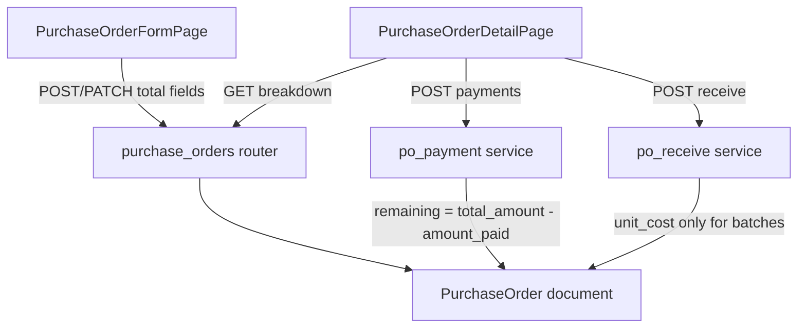

# Architecture — Purchase Order Totals (Discount & Additional Charges)

**Reads:** [prd.md](prd.md)  
**Stack context:** KoMart — FastAPI + Beanie/MongoDB backend, React 19 + MUI frontend

---

## Tech Stack

| Choice | Justification |
|--------|---------------|
| FastAPI + Beanie (`PurchaseOrder` Document) | Existing PO persistence; additive fields need no SQL migration |
| MongoDB | Document defaults handle legacy POs missing new fields |
| Pydantic schemas in `app/schemas/purchase_order.py` | Same create/update/response pattern as today |
| React + MUI on `PurchaseOrderFormPage` / Detail | Single place for create/edit and read-only summary |
| Existing payment service (`po_payment.py`) | Already balances on `total_amount`; no new payment model |
| Cloudinary (bill photos) | Preset from env via `cloudinaryUpload.ts` |

---

## System Overview



**Must-Have mapping**

| PRD feature | Architecture element |
|-------------|----------------------|
| F1–F3 Formula & fields | Model + server `compute_po_totals()` |
| F4 Persist | Beanie fields + schemas |
| F5–F6 UI summary | Form + Detail pages |
| F7 Payments | Unchanged contract: use `total_amount` |
| F8 Legacy | Defaults + response normalization |

**Risk flag:** Client-trusted totals today. v1 should **recompute** subtotal and `total_amount` on the server from items + discount + charges to avoid payment drift.

---

## Data Model

### `PurchaseOrder` (collection `purchase_orders`) — additive fields

| Field | Type | Default | Rules |
|-------|------|---------|-------|
| `subtotal` | float | computed | Sum of `quantity × unit_cost` over items; ≥ 0; round 2 dp |
| `discount` | float | `0` | ≥ 0; ≤ subtotal after clamp |
| `additional_charges` | float | `0` | ≥ 0 |
| `total_amount` | float | computed | `round(max(0, subtotal - discount) + additional_charges, 2)` |

Existing fields unchanged: `items`, `amount_paid`, `payment_status`, `payments`, status workflow, UOM fields.

### Relationships

- Payments and outstanding still key off `total_amount`.
- Inventory batches / receive still key off line `unit_cost` — **no** allocation of discount/charges into landed cost (PRD Non-Goal).
- Optional v1.1: `bill_number: Optional[str]`, `bill_images: list[str]` on PO header.

### Legacy documents

If `discount` / `additional_charges` / `subtotal` absent:

- Treat discount = 0, additional_charges = 0.
- If subtotal missing: `subtotal = total_amount` (or recompute from items when items present).
- Response always returns all four fields normalized.

### Totals helper (conceptual)

```
subtotal = sum(qty * unit_cost for item in items)
discount = min(max(0, discount), subtotal)
additional_charges = max(0, additional_charges)
total_amount = round(max(0, subtotal - discount) + additional_charges, 2)
```

Reject PATCH/POST when `total_amount < amount_paid`.

---

## API Design

Base: `/api/v1/purchase-orders` (existing)

### Create `POST ""` / Update `PATCH /{po_id}`

Request body additions (`PurchaseOrderCreate` / `PurchaseOrderUpdate`):

| Field | Required | Notes |
|-------|----------|-------|
| `discount` | no | default 0 |
| `additional_charges` | no | default 0 |
| `total_amount` | optional after change | Server may ignore client total and set computed value; or accept and validate within 0.01 of computed |
| `subtotal` | optional | Prefer server-computed from `items` |

Response (`PurchaseOrderResponse`) always includes `subtotal`, `discount`, `additional_charges`, `total_amount`.

### Unchanged endpoints

- `POST /{id}/payments` — still uses `total_amount` for remaining balance.
- `POST /{id}/receive` — unchanged cost logic.
- `PATCH /{id}/status` — cancel rules unchanged (no cancel from `received`).

### Bill fields (status-independent)

- `bill_number`, `bill_images` on create/update/list/detail response (optional).
- Manager+ `PATCH /{id}/bill` — body `{ bill_number?, bill_images? }`; updates **only** those fields; allowed in **any** PO status (including `received` / `cancelled`); does not call `_po_is_editable`; does not rewrite `PurchasePriceHistory`.
- General `PATCH /{id}` may still accept bill fields when the PO is editable; Detail always uses `/bill` for corrections.
- List UI: **Bill no.** column reads `bill_number` from list payload (no extra endpoint).

### Optional / deferred

- Optional `GET` query / filter by `bill_number` (F11).
- Manager-only PATCH for financial fields when status = `received` (lines immutable) — removed from product; do not reintroduce without ask.

---

## Folder / Project Structure

```
backend/app/
  models/purchase_order.py      # add fields + optional helpers
  schemas/purchase_order.py     # Create/Update/Response
  routers/purchase_orders.py    # recompute on create/update
  services/po_payment.py        # no formula change (uses total_amount)
  services/po_receive.py        # no landed-cost change
  tests/test_po_totals.py       # new

frontend/src/
  types/index.ts                # PurchaseOrder fields + PurchaseOrderBillPayload
  pages/purchase-orders/
    PurchaseOrderFormPage.tsx   # Order Summary + bill fields (editable statuses)
    PurchaseOrderDetailPage.tsx # read-only breakdown + Edit bill (any status)
    PurchaseOrdersPage.tsx      # list includes Bill no. column
  hooks/usePurchaseOrders.ts    # useUpdatePurchaseOrderBill
  utils/cloudinaryUpload.ts     # PO bill preset from env
  utils/poTotals.ts             # shared client formula (optional mirror)
```

---

## Third-Party Integrations

| Integration | v1 | v1.1 |
|-------------|----|------|
| Cloudinary bill upload | Yes | Preset from env (`VITE_CLOUDINARY_UPLOAD_PRESET_PURCHASEORDER`) via [`cloudinaryUpload.ts`](../frontend/src/utils/cloudinaryUpload.ts); folder configured on the Cloudinary preset |
| Payment gateways | N/A | N/A |

---

## Non-Functional Requirements

| Area | Requirement |
|------|-------------|
| Performance | Totals compute O(n) over line items; negligible for typical PO sizes (&lt; 500 lines) |
| Security | Manager+ for create/update (existing); cashiers cannot edit POs |
| Consistency | Server is source of truth for `total_amount` |
| Backward compatibility | Old documents readable without migration script |
| Audit | Existing `po_snapshot` should include discount, charges, subtotal when updated |

---

## Key Technical Decisions & Tradeoffs

| Decision | Choice | Tradeoff |
|----------|--------|----------|
| Payable-only charges | Do not change receive landed cost | Simpler; COGS ignores freight/discount until Nice-to-Have F15 |
| Flat amounts only | No % discount | Simpler UX; F14 later |
| Server recompute | Prefer over trusting client | Slightly more backend logic; safer payments |
| No hard delete | Cancel + future return | Audit intact; received mistakes need compensating flows |
| Bill images deferred | Should-Have v1.1 | Ships totals first; upload/env complexity later |

### Received PO correction (policy → architecture)

- Lines locked when `status == received`.
- Stock mistakes → purchase return / reverse-receive (F13), not DELETE.
- Money-only mistakes → optional v1.1 financial amend or supplier settlement outside stock.
- Sales already made → never void sales to “undo” PO; return unsold remainder only.

### F13b — Stock-only write-off tracking (report-first)

**Problem:** `settlement_type=stock_only` already reverses inventory and closes, but posts **no wallet / no PO money** — loss is invisible in cash and sales profit views.

**Locked approach (v1):** **Report-only aggregation** from existing `PurchaseReturn` documents (no fake cash wallet entry; no expense document unless F13c).

```
stockOnlyLoss(period) =
  SUM(total_amount)
  WHERE settlement_type = stock_only
    AND status = closed
    AND return_date in period
```

| Surface | Behavior |
|---------|----------|
| KPI / dashboard | Day + month **Stock-only write-off** (inventory loss at cost); separate from Sales and from `returnInflow` |
| Return detail UI | Label **Stock-only loss** = `total_amount` (cost) |
| Movement Ledger | Keep `purchase_return` OUT; cost already on adjustment — do not invent a second stock move |
| Sales / COGS | **Never** include stock-only in sales profit or COGS |

**API (implement with T092+):** expose sums on dashboard KPI and/or `GET /purchase-returns` summary fields / dedicated report helper — source of truth remains `PurchaseReturn`.

**Out of scope for F13b:** posting wallet memo or Expense rows (Nice-to-Have F13c).

### Technical risks

1. **Reports** that sum `total_amount` will include charges/discounts automatically — verify purchase-order summary reports still make sense (subtotal vs payable). Flag for QA.
2. **Partial PO edit** while `amount_paid > 0`: lowering discount increases total (OK); raising discount may violate `total >= amount_paid`.
3. **Float rounding** must match frontend display (2 dp) to avoid 0.01 payment remainder bugs.
4. **Stock-only loss double-count** if someone later posts an expense (F13c) without excluding F13b KPI — keep one canonical source or mark F13c as replacing report-only.
